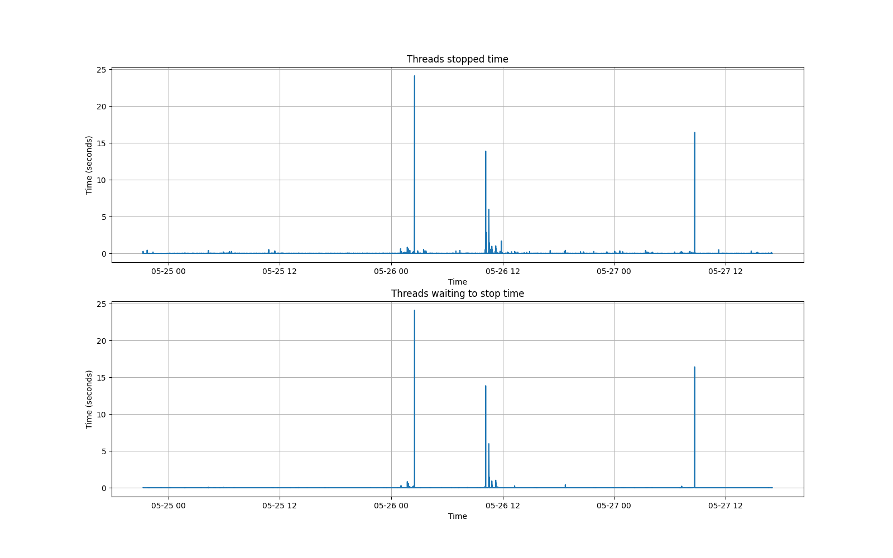
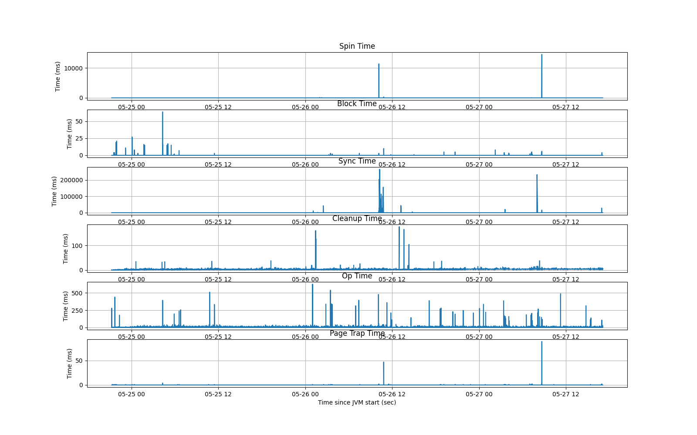

## GC Log Analyzer

This tool is designed to take GC logs as input, and then analyze the amount of stopped time of the
JVM for all entries in the log.

By default, this tool will print out
- the max time spent in a STW JVM Pause
- The top 10 longest instances of a JVM pause
- Display a graph of JVM lifetime vs JVM pause time

Additionally, this can also analyze log output from `-XX:PrintSafePointStatisticsCount=1` to see
which parts of the JVM pausing are taking up time.

## Requirements


### Use from source

- python 3+ (`brew install python@3.8` (macOS), or `sudo apt install python3` (Ubuntu 18.04+/debian))
- `pip3` (pip for python3. Your system may simply call this `pip`)
- virtualenv `pip3 install virtualenv`

Create a the virtual environment, activate, and install dependencies:

```
virtualenv -p python3 env
source env/bin/activate
pip install -r requirements.txt
./gc --help
```

### Build and Install Locally

```
python3 setup.py install
gc-log-analyzer --help
```

## Run

```console
usage: analyze.py [-h] [--top TOP] [--use_gc_timestamps [USE_GC_TIMESTAMPS]]
                  logtype filename

positional arguments:
  logtype               The type of log (accepts 'gc' or 'safepoint'
  filename              the file to analyze

optional arguments:
  -h, --help            show this help message and exit
  --top TOP             The number of top consumers to display for safepoint
                        and GC
  --use_gc_timestamps [USE_GC_TIMESTAMPS]
                        Set this to use actual timestamps (not JVM time) in GC
                        graph output. If running a safepoint analysis, provide
                        a path to the GC log to reference timestamps from.
```

### Example Usage

```console
# Basic analysis, print top 10 pauses and generate full graph
$ ./analyze.py gc <GC log file>

# Same analysis as above, but prints top 20 instead of top 10 pauses
$ ./analyze.py gc <GC log file> --top 20

# Same analysis as above, but prints actual timestamps instead of JVM time
$ ./analyze.py gc <GC log file> --use_gc_timestamps

# Does safepoint statistics analysis, All timestamps in JVM time
$ ./analyze.py safepoint <safepoint statistics log file>

# Safepoint statistics analysis, but cross-references timestamps with GC logs
# to make the output easier to understand
$ ./analyze.py safepoint <safepoint statistics log file> --use_gc_timestamps <gc log file>
```

## Example Output

```console
$ ./analyze.py gc gc.log
Maximum JVM Stopped time: 2020-05-26T02:31:03.576+0000 for 24.1076538 sec
Maximum JVM Waiting to Stop: 2020-05-26T02:31:03.576+0000 for 24.1036957 sec
Top 10 STW Times
2020-05-26T02:31:03.576+0000 stopped: 24.1076538, waiting to stop 24.1036957
2020-05-27T08:40:29.680+0000 stopped: 16.4194076, waiting to stop 16.4066057
2020-05-27T08:40:09.604+0000 stopped: 14.5794211, waiting to stop 14.5748816
2020-05-26T10:10:21.329+0000 stopped: 13.8858189, waiting to stop 13.8537737
2020-05-26T02:30:39.468+0000 stopped: 11.5124063, waiting to stop 0.0009662
2020-05-26T10:30:51.335+0000 stopped: 5.9849815, waiting to stop 5.9785749
2020-05-26T10:10:01.993+0000 stopped: 4.7410384, waiting to stop 4.1447128
2020-05-26T10:16:34.562+0000 stopped: 2.8341711, waiting to stop 0.0007862
2020-05-26T11:52:03.804+0000 stopped: 1.6781226, waiting to stop 0.0006759
2020-05-26T10:34:37.148+0000 stopped: 1.4240997, waiting to stop 1.420486
```


